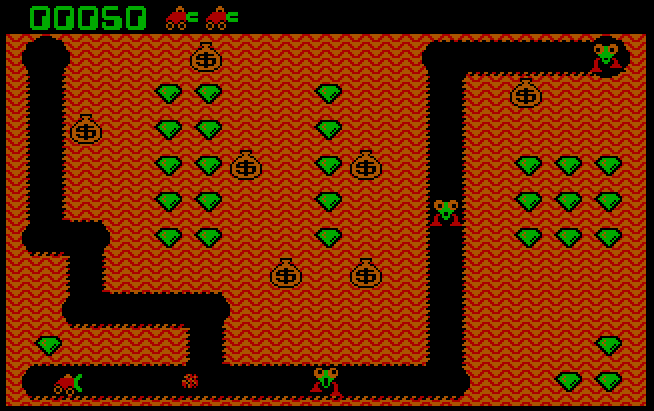

# About

[Digger](https://www.digger.org/) is a classic game. This clone is a complete rewrite, 
although I used the original graphics.

From the player's perspective the main difference with the original game is that this Digger has pixel perfect precision. 

- all animations are smooth (except sprites - which I borrowed from the 1983 Windmill game)
- all object collisions are pixel-based and calculated within a [Resolv](github.com/solarlune/resolv) Space
- collision with the field is based on [SDL_GetRGBA](https://wiki.libsdl.org/SDL2/SDL_GetRGBA)  

# Motivation

I created this clone to learn Go, SDL2, some nuances of embedded programming and game development.

# Build

You need go-sdl2 bindings: https://github.com/veandco/go-sdl2

You can find detailed instructions in the [README.md](https://github.com/veandco/go-sdl2/blob/master/README.md) of go-sdl2.

In general on Windows you would need to install Go and MinGW. 
Download SDL2 packages with DLLs and header files. 
Put DLLs and header files in MinGW folders. 

On Linux you would need to install sdl2-dev packages.

On Windows to build the exe file with static linking I use: 

`go build -ldflags "-s -w -H=windowsgui" -tags static -o bin\digger.exe github.com/geniot/digger/cmd/digger`

I use [GoLand](https://www.jetbrains.com/go/) for development.

To build the OPK file for my [PocketGo2](https://wagnerstechtalk.com/pg2/) I use make:

`make opk`

See the Makefile.

# Links
1. OpenDingux Software list: https://github.com/retrogamehandheld/OpenDingux
2. Go SDL2 bindings: https://github.com/veandco/go-sdl2
3. PocketGo Firmware that I use: https://github.com/Ninoh-FOX/POCKETGO2_ROGUE_CFW
4. Toolchain for it: https://github.com/Ninoh-FOX/toolchain

# Roadmap
1. Digger can fire. 
2. Fireball hits the wall.
2. Bag starts to shake. 
3. Bag can fall. Multiple bags can fall.
4. Bag can turn to gold or stay a bag.
3. Digger can collect gold.
4. Digger can move bags (one or many).
4. Digger can be killed by a bag.
5. Nobbin chases digger.
6. Nobbin can move bags.
7. Nobbin can be killed by bag or fire.
8. Nobbin can turn to Hobbin and back.
8. Hobbin chases digger.
9. Hobbin eats everything: bags, emeralds and field.
11. Hobbin can be killed by fire or a bag.
12. 